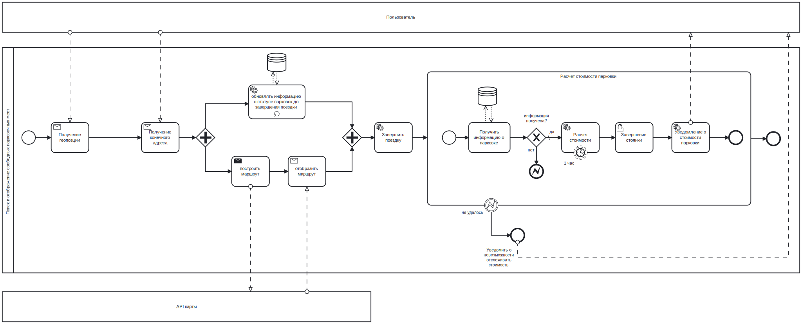
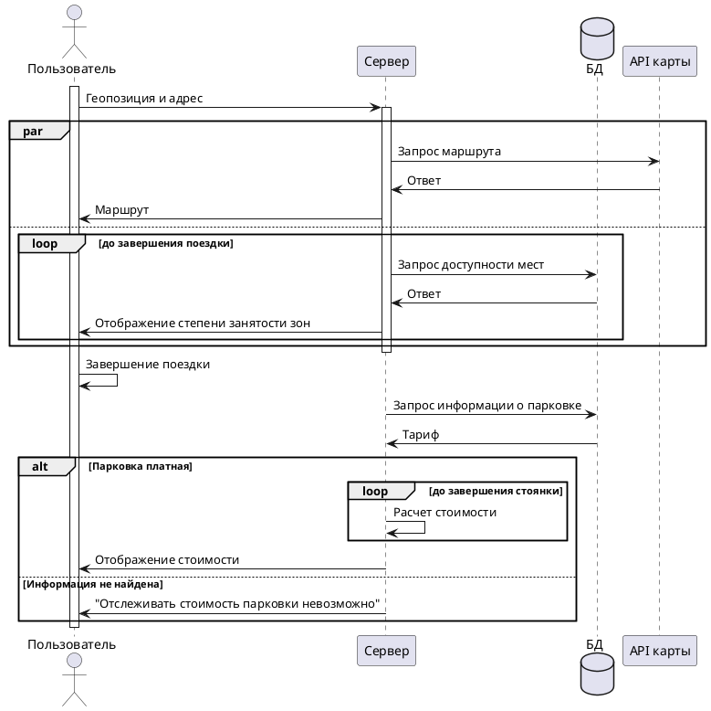

```plantuml

@startuml
actor "Пользователь" as u
participant "Сервер" as s
database "БД" as db
participant "API карты" as m

activate u
u -> s: Геопозиция и адрес
activate s
par
s -> m: Запрос маршрута
m -> s: Ответ
s -> u: Маршрут
else
loop до завершения поездки
s -> db: Запрос доступности мест
db -> s: Ответ
s -> u: Отображение степени занятости зон
end
end
deactivate s
u -> u: Завершение поездки


s -> db: Запрос информации о парковке
db -> s: Тариф
alt Парковка платная
loop до завершения стоянки
s -> s: Расчет стоимости
end
s -> u: Отображение стоимости
else Информация не найдена
s -> u: "Отслеживать стоимость парковки невозможно"
end
deactivate u
@enduml


```
